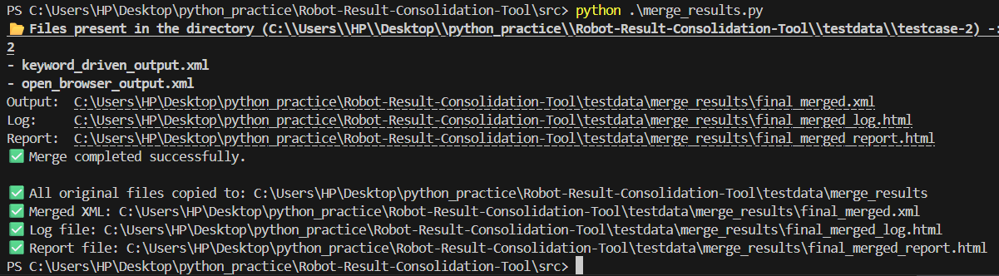

# Robot-Result-Consolidation-Tool
This Repo contains files to consolidate robot framework result files.

Listner usage -:

List xml files present in test case 2 directory -:

Print results for files present in test case 2 directory -:

Check user specified tags in the given results directory (test case 2) -:

Merge the given robot files -:

List test matching with tag of any pattern from your result folder -: 

Statistics of all results files in your current folder along with list of all fail result files present in your folder.
